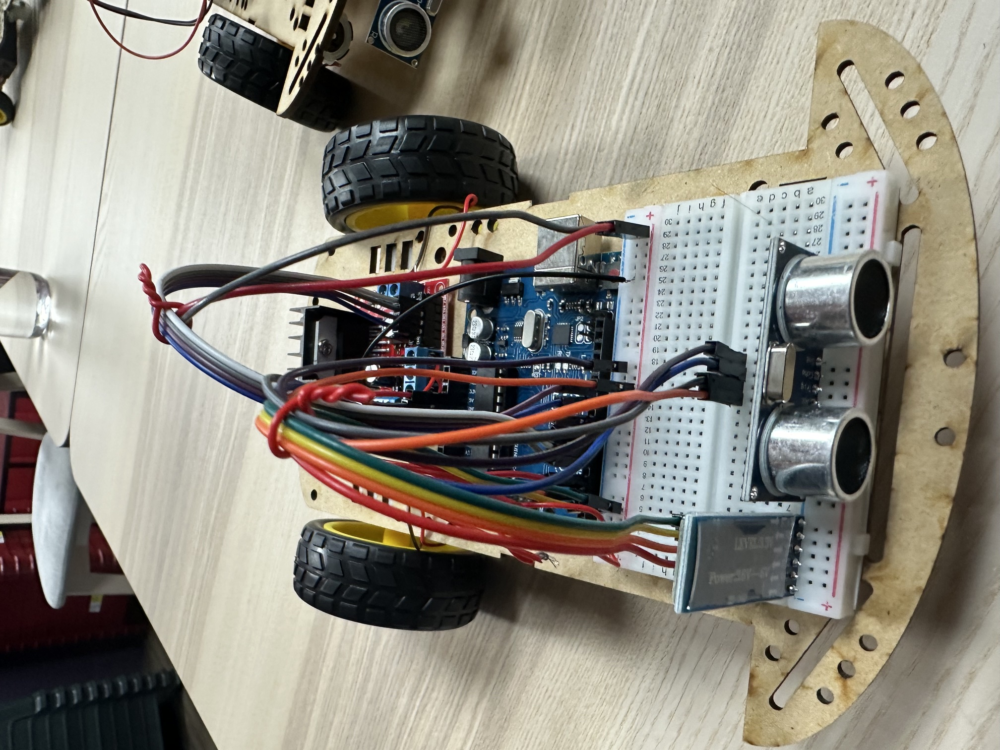
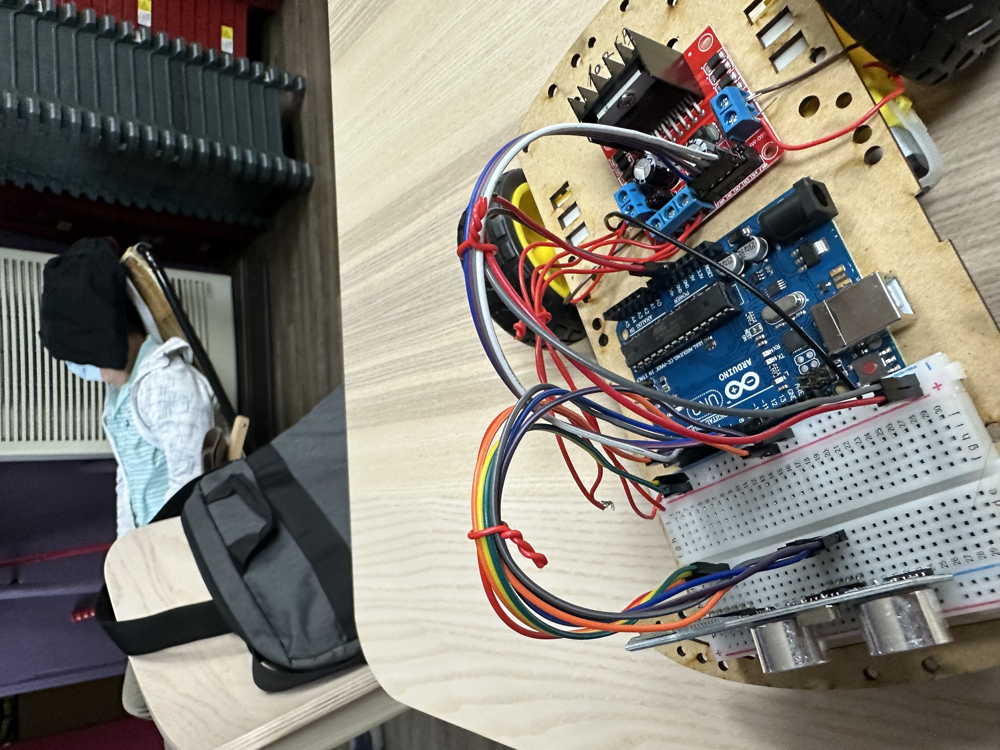

# AIoT Smart Obstacle Avoidance Car

An Arduino-based smart obstacle avoidance vehicle integrating ultrasonic sensing, Bluetooth remote control, and motor driver control.

## Project Photos

### Front View

### Side View

## Hardware Components

- Arduino Uno
- HC-SR04 Ultrasonic Sensor
- HM-10 Bluetooth Module
- L298N Motor Driver
- DC Motors
- Battery Pack

## Features

- Automatic obstacle detection
- Bluetooth remote control
- Real-time distance measurement
- Obstacle avoidance mechanism
- Differential motor drive control

## Software

- Arduino IDE
- BLE Joystick Mobile App
